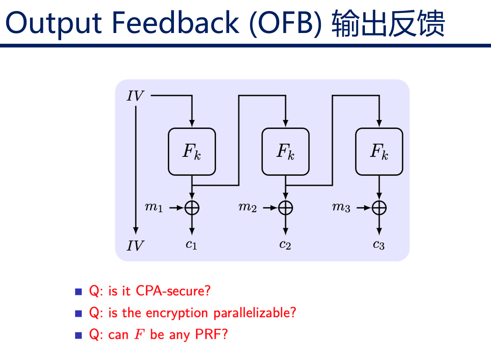

# HIT 密码学 实验二
## 必要假设
整个实验，假设通信的双方已经同步了初始向量和所有秘钥。在实验过程中简化为将iv,key,以及mac等秘钥保存在key目录下，以模拟双方都同步了秘钥。

本次实验主要是针对图片内容加密，因此不能对图片文件格式造成破坏以至于无法打开，同时针对密文的攻击也以对内容部分的攻击为主.

假设敌手知道加密方案。（其实不知道也行，因为翻转密文的特定位也能被解密，也能看关系）

## CPA加密
采用OFB加密块加密方案。利用AES做为PRP，生成伪随机数，由于敌手无法预测初始向量的规律，因此随机数与真随机数的差异可忽略。

**为了实验的封装性，将CPA和第三问的CCA封装成class，这样也便于写解密预言机**

### 实验思路

1. 图片的选择

我们都知道，所谓图片其实就是bytes矩阵，由于本次实验选择的图片带有颜色，因此选用颜色空间为RGB的png图片作为实验加解密主要对象。`python`中提供了相当多的图片处理库，常见的有`pillow`和`PIL`,本实验选择PIL

```Python
from PIL import Image
```

然后使用上下文来读取rgb三色空间

```python
with Image.open(input_path) as img:
            r, g, b = img.split()
```


这样，在整个上下文空间中，我们就有了`img`对象

然后，利用`image`（因为这个便于后续做异或，以及slice，而且其实是作者用的比较熟悉（））

```python
 r_processed = self._encrypt_schema(np.array(r, dtype=np.uint8).tobytes())
 g_processed = self._encrypt_schema(np.array(g, dtype=np.uint8).tobytes())
 b_processed = self._encrypt_schema(np.array(b, dtype=np.uint8).tobytes())
```

这个解密 首先要在初始过程中设置好加解密器，

```python
def __init__(self, key_path=r"lab2\key\key.bin", iv_path=r"lab2\key\iv.bin"):
        # 生成或读取密钥和IV
        if not os.path.exists(key_path) or not os.path.exists(iv_path):
            self.key = os.urandom(32)  # AES-256要求的密钥长度
            self.iv = os.urandom(16)   # OFB模式的IV大小
            with open(key_path, "wb") as key_file:
                key_file.write(self.key)
            with open(iv_path, "wb") as iv_file:
                iv_file.write(self.iv)
            self.cipher = Cipher(algorithms.AES(self.key), modes.OFB(self.iv), backend=default_backend())
        else:
            with open(key_path, "rb") as key_file:
                self.key = key_file.read()
            with open(iv_path, "rb") as iv_file:
                self.iv = iv_file.read()
            self.cipher = Cipher(algorithms.AES(self.key), modes.OFB(self.iv), backend=default_backend())
```

如图，利用`Cipher(algorithms.AES(self.key), modes.OFB(self.iv), backend=default_backend())`来创建一个对象，通过调用对象中的`encryptor = self.cipher.encryptor()`来创建加密器，`decryptor = self.cipher.decryptor()`来创建解密器，

```python
decryptor.update(image) + decryptor.finalize()
```

在密码学中，特别是在使用对称加密算法如AES进行加密和解密时，`finalize`方法的作用是完成加解密过程的最后一步。这个方法通常在处理完所有的数据块后被调用，以确保所有的加密或解密操作都已经完成，包括处理任何剩余的数据（例如，在加密模式需要填充的情况下）以及执行必要的清理和状态重置。

具体到`decryptor.update(image) + decryptor.finalize()`这个表达式，这是在使用一个加密库（如Python中的cryptography库）时，进行解密操作的典型步骤。这里，`decryptor`是一个解密器对象，它负责对密文进行解密操作。这个过程通常分为两步：

1. **更新（update）**: `decryptor.update(image)`这部分负责处理大部分的密文数据。`update`方法可以被多次调用，用于逐步处理密文。在流式加密或者需要分块处理大量数据的场景中，这允许数据被逐块处理，而不是一次性加载到内存中。
2. **完成（finalize）**: `decryptor.finalize()`这部分则标志着解密操作的结束。调用`finalize`方法以完成解密过程，处理可能的最后一个数据块，并且在某些情况下（如需要去除填充）进行必要的后处理。一旦调用了`finalize`方法，解密器对象通常就不能再被用于解密其他数据块。

组合使用`update`和`finalize`方法提供了一种灵活处理加解密操作的方式，特别是在处理大量数据或者需要根据数据流动态加解密时。这种模式不仅适用于解密，同样适用于加密过程。

这样，加密之后没有破坏png的原始结构，但是将png的内容进行隐藏。

## 对CPA加密，利用CCA攻击

CPA类提供接口

```
def _decrypt_schema(self, image):
        decryptor = self.cipher.decryptor()
        return decryptor.update(image) + decryptor.finalize()
```

调用时仅需

```
cca.encrypt_image(r'lab2\img\微信图片_20240328235356.jpg', r'lab2\img\avatarencCCA.png')
```

可见，函数的参数仅仅就是图片的路径而已，因此IV和Key是被隐藏的。

这也是将加密方案封装起来的原因，（因为在CCA攻击的代码下放着IV 和key总觉得不是很优雅），这样实现的Oracle为

```python
def decrypt_oracle(input_file, output_file):
    cpa = CPA()
    return cpa.decrypt_image(input_file, output_file)
```

这就很优雅

我们知道，在CCA敌手下，挑战过程中，敌手可以问oracle所有除了已知密文的所有密文，从而获得对应的明文， 由于上面的方案是CPA安全而不是CCA安全（密文没有不可锻造性），所以敌手可以通过篡改密文中的比特来让oracle给他解密，由于这是个图片，跟以前的实验仅仅是字符串不一样，单独解密一两个bit很难看出有什么端倪，因此反正敌手都这么强了，不如干票大的：

将图片上半部分比特取反，然后解密，输出，再将下半部分比特取反，解密，然后将这两个图片下部分和上部分拼接，就得到了最终的明文。



根据OFB的方案，我们将IV丢到F中，会得到一堆生成好的F的输出，然后和明文$m_x$异或。

如果解密，采用同一个IV，那么F输出的那一堆向量不变，将篡改后的密文$c^'_i$和结果异或，可以发现其实颜色被取反了（因为异或的输入有一个取反有一个不变，结果也相当于取反）。也能获得一些信息。但是其余没有篡改的部分会被正常解密，那那些部分就可以被利用起来。

所以我们将这些部分拼凑起来就可以得到最终的明文。

如果是CBC


就可以

1. **选择目标块**：决定你想要修改的密文块。如果你修改第N个块的密文，那么这个修改会直接影响第N+1个块的明文（由于CBC的XOR特性）。
2. **执行修改**：执行实际的修改，比如可以通过XOR操作对选定的密文块中的一些位进行反转。
3. **观察结果**：解密修改后的密文，并观察如何影响明文。特别是观察被直接修改的块和其后一个块的变化。

## CCA加密方案

CCA之所以能对CPA安全的加密方案进行攻击的主要原因是因为，加密方案在解密过程中无法得知，输入的密文是否已经被篡改。因此我们可以给方案加上一个验证，当发现密文被篡改了的时候，就抛出异常，由此我们想到最近学的MAC和CRHF。

### PNG文件结构

https://blog.csdn.net/szzheng/article/details/105177740

我们在对图片加密的时候，先利用PIL加载图片，在RGB三个通道下对内容进行加密，然后在对图片的内容做一个MAC，生成一个标签，然后将标签放在pnginfo上和生成的加密png一起保存。

在解密的时候，我们首先对png的内容生成一个mac，然后提取出png文件特定位置的mac，对这两个mac做校验，如果mac不一致，那么就说明图片的内容被敌手篡改，否则验证通过，开始解密。

```python
def _add_mac_chunk(self, image, mac):
        metadata = PngImagePlugin.PngInfo()
        metadata.add_text("MAC", mac.hex())
        image.save("temp.png", pnginfo=metadata)
        return Image.open("temp.png")

def _get_mac_from_chunk(self, image):
    metadata = image.info
    return bytes.fromhex(metadata.get("MAC", ""))

def _generate_image_mac(self, image_data):
        # 生成图像内容的 MAC
        h = hmac.new(self.mac_key, msg=image_data, digestmod=hashlib.sha256)
        return h.digest()
```


这样，当敌手尝试修改图片内容时，mac就会发生变化，从而会让验证器抛出异常。
